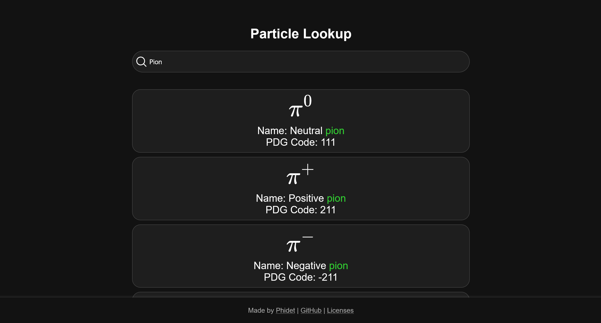

# PDGID Search - [Try it here](http://pdg.det.je/)

## Overview
A simple tool for when you have a PDG code and want to know the particle or if you can’t quite remember the PDG code for Argon...

## TODO
Some of the full particle names have room for improvement.

## Contribution
Improvement suggestions are welcome!

## License
Licensed under the MIT License. See the LICENSE file in the repository for details.
